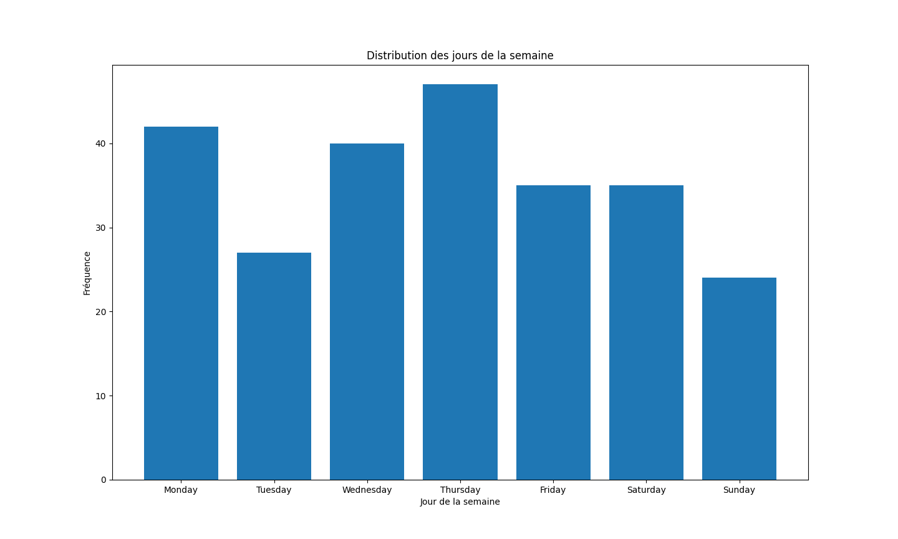

# Comment ai-je utilisé l'analyse de données au service de ma boutique e-commerce? 

## Résumé 

En février, j'ai créé une boutique e-commerce que j'ai conçue avec Shopify et que j'ai fait connaître grâce à TikTok Ads. 
Grâce à l'API de Shopify sur Python et à partir de 2 mois de données de clients (250 ventes), j'ai déterminé que les utilisateurs étaient plus enclins à acheter les lundi et jeudi et qu'à l'inverse le dimanche et le mardi étaient les jours où il y avait le moins d'activité de la semaine.
Cela constitue un véritable outil d'aide à la décision pour moi pour le paramétrage de mes publicités. Ainsi, je ne programme des publicités que les lundi et jeudi en mettant l'accent sur les horaires avec le plus de conversions.
## Introduction
Ce rapport présente un outil élémentaire d'aide à la décision que j'ai développé en python sur un projet personnel de e-commerce de ma boutique en ligne, Dohashop.fr. Le projet a été conçu et exploité par mes soins dans le cadre d'une entreprise individuelle immatriculée en France depuis février dernier.  Dans ce rapport, je vais expliquer les principales fonctionnalités du programme Python que j'ai développé pour analyser les commandes et générer des graphiques basés sur les données de vente.

## Présentation du programme

Le programme Python que j'ai développé utilise différentes bibliothèques et l'API Shopify pour extraire les données des commandes et générer des graphiques représentant la distribution des jours de la semaine et des heures de la journée pour les commandes passées sur Dohashop.fr.

## Contexte, objectifs 

Démarrer une boutique en ligne à partir de zéro est un exercice qui requiert des compétences sur plusieurs aspects. Nous n'allons pas évoquer les aspects liés purement au commerce(ligne éditoriale, proposition de valeur, publicités choisies, conception de l'identité visuelle, SAV ...) pour nous concentrer sur l'**optimisation** des campagnes de publicités s'appuyant sur l'analyse des données.
Ayant mené ce projet seul, j'ai choisi d'utiliser la plateforme Shopify pour développer mon site web afin de focaliser le plus clair de mon énergie sur le développement de ma boutique plutôt que sur le développement web.
Pour faire connaître ma boutique le plus rapidement possible et auprès des prospects les plus qualifiés possible, j'ai choisi d'utliser TikTok. En effet, l'application TikTok est connue pour être le réseau "social" avec le plus fort taux de rétention et avec la plus grande efficacité étant donné que la majorité du contenu visualisé par les utilisateurs de TikTok est suggérée par l'algorithme et non par des recherches conscientes de l'utilisateur (à l'inverse de Netflix ou de Youtube par exemple).


### Bibliothèques utilisées
- `pandas`: Une bibliothèque utilisée pour manipuler et analyser les données extraites.
- `matplotlib`: Une bibliothèque de visualisation de données utilisée pour créer des graphiques.
- `shopify`: Une bibliothèque qui facilite l'accès et la manipulation des données de la boutique Shopify.
- `datetime`: Une bibliothèque pour manipuler des objets de date et d'heure.
- `os`: Une bibliothèque pour effectuer des opérations système, utilisée dans ce projet pour l'affichage des graphiques.
- `calendar`: Une bibliothèque pour effectuer des opérations sur les calendriers, utilisée pour obtenir le nom des jours de la semaine.

### Authentification à l'API Shopify
Avant de pouvoir accéder aux données de la boutique Shopify, j'ai dû m'authentifier à l'API Shopify en utilisant l'URL de la boutique, le jeton d'API et la version de l'API. Voici les informations d'authentification utilisées dans le programme :
```python
shop_url ='hyshopify.com'
token='shpa55ba01930d08'
api_session= shopify.Session(shop_url, '2023-04', token)
shopify.ShopifyResource.activate_session(api_session)
```

### Extraction des données des commandes
Une fois authentifié à l'API Shopify, j'ai utilisé la méthode `shopify.Order.find()` pour extraire les données des commandes. J'ai limité la récupération à 250 commandes avec n'importe quel statut (en cours, terminées, annulées, etc.) pour une période donnée.

### Analyse des données des commandes
Après avoir extrait les données des commandes, j'ai procédé à l'analyse des données pour obtenir des informations sur la distribution des jours de la semaine et des heures de la journée pour les commandes passées sur Dohashop.fr.

#### Distribution des jours de la semaine
J'ai utilisé la bibliothèque `datetime` pour extraire le jour de la semaine à partir de la date de création de chaque commande. J'ai ensuite mis à jour un dictionnaire `weekdays_orders` pour compter le nombre de commandes passées chaque jour de la semaine.

```python
date_format = "%Y-%m-%dT%H:%M:%S%z"
weekdays_orders = {
    "Monday": 0,
    "Tuesday": 0,
    "Wednesday": 0,
    "Thursday": 0,
    "Friday": 0,
    "Saturday": 0,
    "Sunday": 0
}

for order in orders:
    date = datetime.strptime(order.created_at

, date_format)
    day_of_week = date.strftime("%A")
    weekdays_orders[day_of_week] += 1
```

Une fois les données analysées, j'ai utilisé la bibliothèque `matplotlib` pour créer un graphique à barres représentant la distribution des jours de la semaine pour les commandes.

#### Distribution des heures de la journée
J'ai également extrait l'heure de création de chaque commande et mis à jour un dictionnaire `hours_dict` pour compter le nombre de commandes passées à chaque heure de la journée.

```python
hours_dict = {str(hour).zfill(2): 0 for hour in range(24)}

for order in orders:
    heure_commande = order.created_at[11:13]
    hours_dict[heure_commande] += 1
```

De la même manière que pour la distribution des jours de la semaine, j'ai utilisé la bibliothèque `matplotlib` pour créer un graphique à barres représentant la distribution des heures de la journée pour les commandes.

## Résultats et visualisations
Les graphiques obtenus à partir des données analysées sont les suivants :

### Distribution des jours de la semaine


Ce graphique présente la fréquence des commandes passées pour chaque jour de la semaine. Il permet de visualiser les jours de la semaine où les commandes sont les plus nombreuses.

### Distribution des heures de la journée


Ce graphique représente la fréquence des commandes passées à chaque heure de la journée. Il permet d'identifier les heures de la journée où les commandes sont les plus fréquentes.

## Conclusion

L'API de shopify permet d'extraire des informations intéressantes de sa boutique qui seraient disponibles moyennant de mettre à niveau son abonnement mensuel.
Cette analyse de la répartition en fonction des jours et des heures de mes 250 premières ventes ont révélé une tendance déjà rencontrée dans des articles de blog que j'ai consulté avant de faire cette étude sur ma propre boutique : les consommateur sur internet sont plus enclins à passer commande le lundi et le jeudi.

Avec plus de données, j'aurais mené des études plus complexes en m'intéressant à la combinaison jour-heure et aux saisonnalités qu'il pourrait exister dans les tendances des consommateurs. Cela me permettrait d'automatiser complètement mes investissements eet mes enchères sur la plateforme TikTok Ads.
Remarque : Après des essais successifs sur Meta Ads, Google Ads et TikTok Ads, j'ai choisi de ne retenir TikTok Ads au regard de sa très nette supériorité quant aux ROIs. Si j'avais choisi de combiner sources de trafic j'aurais du mener une étude comparative en m'appuyant sur les *pixels* des différentes plateformes.


